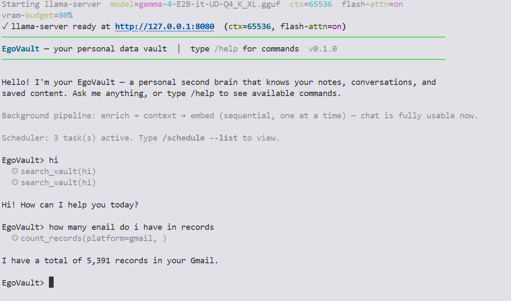
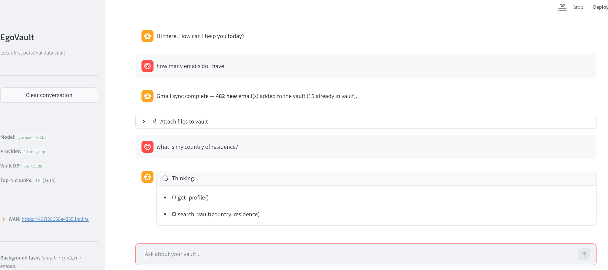
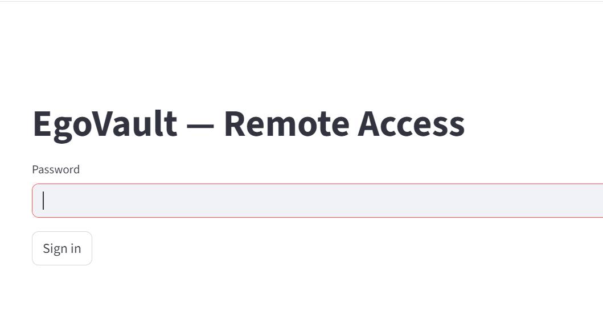
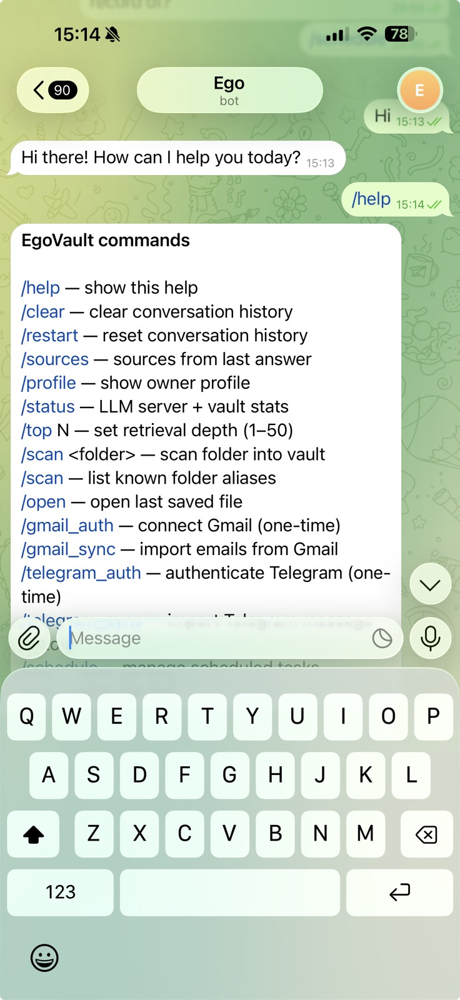

# EgoVault

> Your personal data, on your machine, under your control.

[](https://github.com/milika/EgoVault/actions/workflows/ci.yml)
[](LICENSE)
[](https://www.python.org/)

Every message you sent, every article you saved, every decision you made - scattered across platforms
that own your data, monetise your attention, and can delete your history without warning.

**EgoVault puts it all back in your hands.**

---

## Why this exists

Big Tech has had a good run storing your life for you. In return, they read your emails, sell your
patterns, and hand your data to whoever asks politely enough. You get a "free" service and a
privacy policy nobody reads.

We think that deal is broken.

Your memories do not belong to a corporation. Your conversations are not a product. The decisions,
ideas, and relationships you've built over years are *yours* - and you should be able to search
them, learn from them, and take them with you, without asking anyone's permission.

EgoVault is a local-first personal data vault. It runs on your hardware, uses a local LLM that
never phones home, stores everything in a single SQLite file you can copy to a USB drive, and
answers your questions without sending a single byte to a third party.

> **No subscriptions. No telemetry. No cloud lock-in.**  
> Cloud sync is a future opt-in - never the default.

---

## Hardware requirements
The default model (Gemma 4 E2B, ~3.2 GB) runs on CPU but is significantly faster on a CUDA-capable GPU.  

---

## Get started in one line

**Windows - PowerShell** (Windows 10/11, PowerShell 5+)
```powershell
irm https://raw.githubusercontent.com/milika/EgoVault/main/scripts/install-win.ps1 | iex
```

**Windows - Command Prompt** (runs the same PowerShell script)
```cmd
powershell -NoProfile -ExecutionPolicy Bypass -Command "irm https://raw.githubusercontent.com/milika/EgoVault/main/scripts/install-win.ps1 | iex"
```

**Linux / WSL - bash or sh**
```bash
curl -fsSL https://raw.githubusercontent.com/milika/EgoVault/main/scripts/install.sh | sh
```

**macOS - zsh (default) or bash**
```zsh
curl -fsSL https://raw.githubusercontent.com/milika/EgoVault/main/scripts/install.sh | sh
```

**Any platform - pipx** (Python 3.11+ required)
```bash
pipx install egovault
```

Then:
```bash
egovault chat          # terminal REPL
egovault web           # browser UI - prints a public URL automatically
egovault mcp           # MCP server for AnythingLLM / Claude Desktop
```

> Full installation, configuration, and llama-server setup: [docs/installation.md](docs/installation.md)  
> Can't see the file? View it on [GitHub](https://github.com/milika/EgoVault/blob/main/docs/installation.md).

---

## What you can do

- **Reclaim your history** - import emails, documents, chats, and notes from any platform
- **Ask questions across everything** - "What did I decide about X last year?" - one answer, all sources
- **Own the inference** - a local LLM reads and enriches your data; nothing leaves your machine
- **Access from anywhere** - `egovault web` punches a secure tunnel so you can reach your vault from any device
- **Take it with you** - the entire vault is one file; copy it, back it up, move it freely

---

## Data sources

| Source | Status |
|--------|--------|
| Local files (PDF, DOCX, HTML, Markdown, EPUB, spreadsheets, plain text) | :white_check_mark: |
| Gmail - Takeout / live API (OAuth2) / IMAP | :white_check_mark: |
| Telegram export | :white_check_mark: |
| WhatsApp, Facebook Messenger | :hourglass_flowing_sand: planned |
| Instagram, LinkedIn, Twitter/X, TikTok | :hourglass_flowing_sand: planned |
| Obsidian vault, Calendar (ICS) | :hourglass_flowing_sand: planned |

---

## Interfaces

| Interface | How to start |
|-----------|-------------|
| Terminal REPL | `egovault chat` |
| Browser UI | `egovault web` |
| Telegram bot | `egovault telegram` |

> How it works under the hood -> [docs/how-it-works.md](docs/how-it-works.md)

---

## Screenshots

**Terminal REPL** — llama-server auto-starts and chat is ready immediately  


**Browser UI** — chat with your vault, tool calls shown inline  


**Remote access login** — password-protected page served over a secure WAN tunnel  


**Telegram bot** — full command set accessible from any device  


---

## Roadmap

### Adapters coming next
- [ ] WhatsApp, Facebook Messenger, Instagram, LinkedIn, Twitter/X
- [ ] Obsidian vault reader, Calendar ICS

### Features coming next
- [ ] Reminders - `/remind <text> at <datetime>` with due alerts in chat
- [ ] Notes - `/note <text>` stored and searchable like any vault record
- [ ] Multi-level access control (owner -> guest, passphrase auth)
- [ ] `egovault doctor` - health-check command

Your data, your rules. Contributions and ideas are welcome - see [CONTRIBUTING.md](CONTRIBUTING.md).

---

## Changelog

See [CHANGELOG.md](CHANGELOG.md) for a full history of releases.

---

## License

[MIT](LICENSE) (c) 2026 Milika Delic
